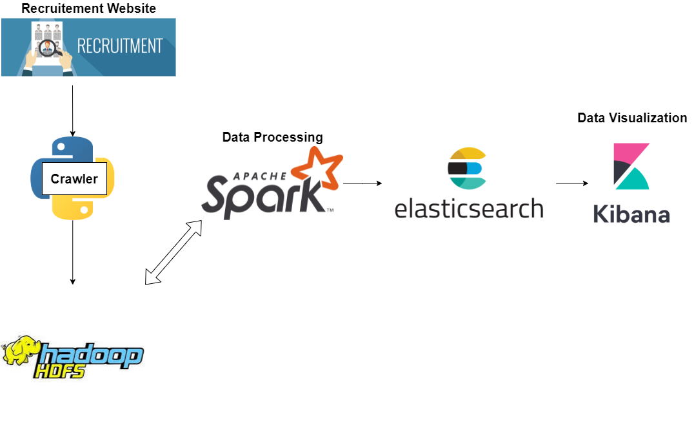
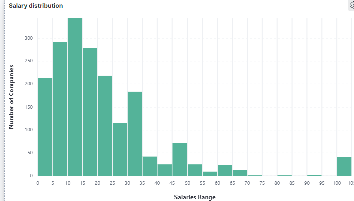

<div align="center">

# HDFS Spark Elasticsearch and Kibana

</div>

# Brief Introduction
In this project, we want to get some insight of the labor market, with data crawled from recruitment website. We focus on IT jobs demand in [TopCV.vn](https://www.topcv.vn/viec-lam).

Our system is designed as follow:


Crawled data is first uploaded to HDFS cluster. Spark Cluster reads that data and filters information about frameworks, plattforms, design patterns, programming languages, knowledges and salaries. The extracted data will be saved again in HDFS Cluster (for storage) and Elasticsearch cluster (for visualization in Kibana).

Here is an example of visualization in Kibana about salary range 


See the `report` directory for the full report and slide.
# Data Prepataion
- Crawled data is stored in `rawdata` folder
- Code to crawl is from my [IT-Jobs-TopCV-Crawler](https://github.com/tienlonghungson/IT-Jobs-TopCV-Crawler)

# Work Flow
We first create 2 directories in HDFS cluster: `/data/rawdata` and `/data/extracteddata`. The crawled data will be uploaded to `/data/rawdata`.

Execute the bash file `run.sh` (this bash will turn on docker compose, upload src folder and jar files to spark-master)
```
/bin/bash run.sh
```
Come inside spark-master node
```
docker exec -it spark-master /bin/bash
```
Do the spark-submit jobs:
```
spark/bin/spark-submit --master spark://spark-master:7077 --jars elasticsearch-hadoop-7.15.1.jar --driver-class-path elasticsearch-hadoop-7.15.1.jar src/main.py 
```

# Requirement:
- At least 8GB RAM (but kibana needs to be left out)
- Set vmmem at least 4.5GB RAM

# Acknowledgement
This project can not be completed without the help of our friend (also our advisor) [Quan Nguyen](https://github.com/coldzys), and the one who gave us the idea, our brother [Xuan Nam](https://github.com/namnx96).

The following sources are helpful:
- https://datascienceandengineering.com/projects/data-analysis-using-spark-and-elasticsearch/
- https://spark.apache.org/docs/latest/submitting-applications.html
- https://www.tutorialspoint.com/kibana/kibana_aggregation_and_metrics.htm


